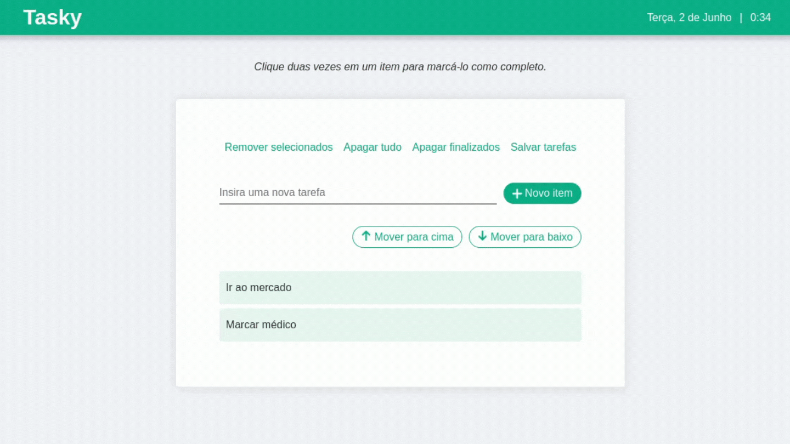

# Tasky

## Sobre
Pequena aplicação de registro de tarefas diárias desenvolvida tendo como base um projeto de "To do List", realizado durante o módulo de Fundamentos do Desenvolvimento Web na Trybe.

Trata-se de uma aplicação de lista de tarefas, em que os usuários podem adicionar itens, movê-los, marcá-los como concluídos e excluí-los. A lista também pode ser salva no localStorage, para que o usuário não perca suas tarefas ao sair da página.

Foi feito em HTML, CSS e Javascript puro.

## Tecnologias utilizadas:
* HTML5
* CSS3
* JavaScript ES6+

